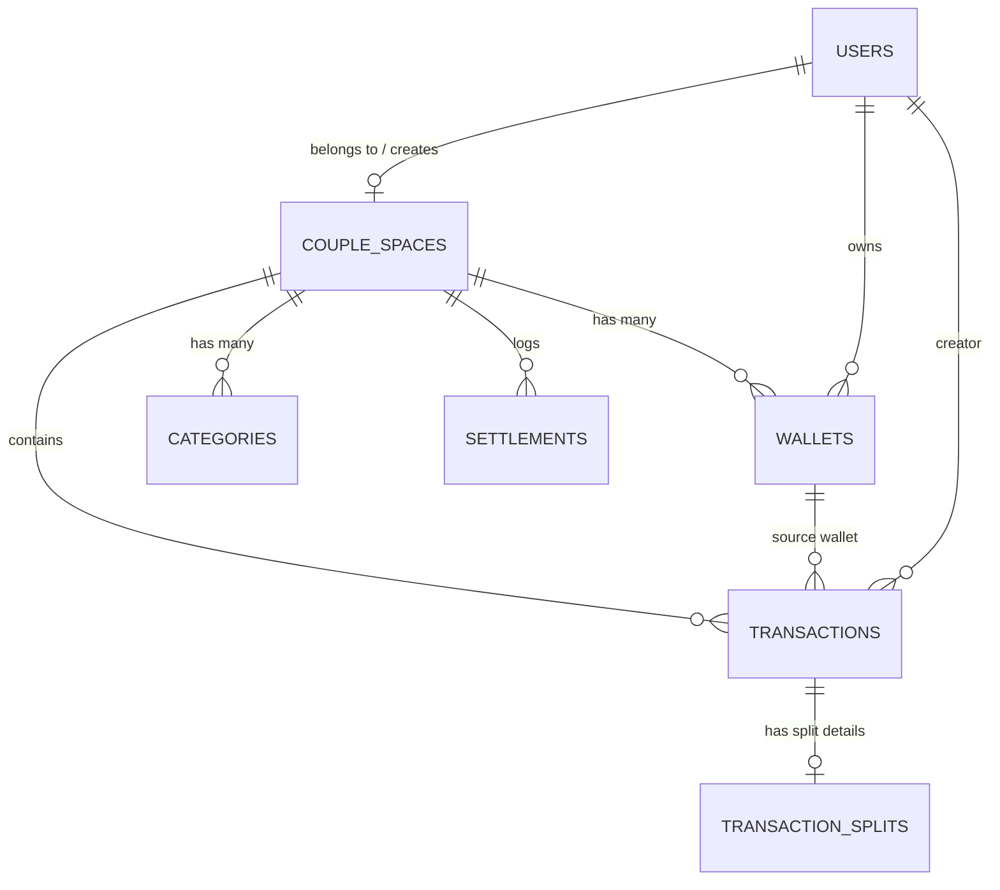

# 🗄️ Database Architecture & Schema Blueprint (Fase 1)

Rancangan database relational untuk fitur **User Pairing, Multi-Wallets, Transactions, & Smart Split Bill / Settlement**.

---

## 1. Tables Overview & Relationships

---

## 2. Table Specifications

### A. `couple_spaces`
Ruang kerja bersama untuk 2 pengguna yang berpasangan.
* `id`: `BIGINT UNSIGNED PRIMARY KEY AUTO_INCREMENT`
* `name`: `VARCHAR(100)` (e.g., "Rony & Sarah Space")
* `invite_code`: `VARCHAR(16) UNIQUE INDEX` (Kode 6-8 digit unik untuk pairing)
* `user_one_id`: `FOREIGN KEY -> users(id)` (Inisiator)
* `user_two_id`: `FOREIGN KEY -> users(id) NULLABLE` (Pasangan yang join)
* `status`: `ENUM('pending', 'active') DEFAULT 'pending'`
* `anniversary_date`: `DATE NULLABLE`
* `created_at`, `updated_at`: `TIMESTAMP`

### B. `wallets`
Dompet / rekening keuangan (Pribadi & Bersama).
* `id`: `BIGINT UNSIGNED PRIMARY KEY AUTO_INCREMENT`
* `couple_space_id`: `FOREIGN KEY -> couple_spaces(id) ON DELETE CASCADE`
* `user_id`: `FOREIGN KEY -> users(id) NULLABLE` (NULL jika tipe `joint`)
* `name`: `VARCHAR(100)` (e.g., "BCA Utama", "GoPay", "Kas Kencan")
* `type`: `ENUM('personal', 'joint')`
* `wallet_type`: `ENUM('bank', 'ewallet', 'cash', 'investment', 'credit_card')`
* `account_number`: `VARCHAR(50) NULLABLE`
* `balance`: `DECIMAL(15, 2) DEFAULT 0.00`
* `currency`: `VARCHAR(3) DEFAULT 'IDR'`
* `color`: `VARCHAR(20) DEFAULT '#6366F1'`
* `icon`: `VARCHAR(50) DEFAULT 'wallet'`
* `is_active`: `BOOLEAN DEFAULT TRUE`
* `created_at`, `updated_at`: `TIMESTAMP`

### C. `categories`
Kategori transaksi pemasukan & pengeluaran.
* `id`: `BIGINT UNSIGNED PRIMARY KEY AUTO_INCREMENT`
* `couple_space_id`: `FOREIGN KEY -> couple_spaces(id) ON DELETE CASCADE NULLABLE`
* `name`: `VARCHAR(100)` (e.g., "Makan & Kencan", "Transport", "Gaji", "Belanja")
* `type`: `ENUM('income', 'expense')`
* `icon`: `VARCHAR(50)`
* `color`: `VARCHAR(20)`
* `is_default`: `BOOLEAN DEFAULT FALSE`
* `created_at`, `updated_at`: `TIMESTAMP`

### D. `transactions`
Catatan transaksi keuangan harian.
* `id`: `BIGINT UNSIGNED PRIMARY KEY AUTO_INCREMENT`
* `couple_space_id`: `FOREIGN KEY -> couple_spaces(id) ON DELETE CASCADE`
* `user_id`: `FOREIGN KEY -> users(id)` (User yang menginput)
* `wallet_id`: `FOREIGN KEY -> wallets(id) ON DELETE RESTRICT` (Dompet sumber)
* `to_wallet_id`: `FOREIGN KEY -> wallets(id) NULLABLE` (Hanya untuk tipe `transfer`)
* `category_id`: `FOREIGN KEY -> categories(id) NULLABLE`
* `type`: `ENUM('income', 'expense', 'transfer')`
* `scope`: `ENUM('personal', 'shared')` (Personal expense vs shared date/living expense)
* `amount`: `DECIMAL(15, 2)`
* `transaction_date`: `DATETIME`
* `notes`: `TEXT NULLABLE` (Catatan / Love Notes)
* `receipt_image_path`: `VARCHAR(255) NULLABLE`
* `created_at`, `updated_at`: `TIMESTAMP`

### E. `transaction_splits`
Detail kalkulasi split bill / talangan saat pengeluaran bersama.
* `id`: `BIGINT UNSIGNED PRIMARY KEY AUTO_INCREMENT`
* `transaction_id`: `FOREIGN KEY -> transactions(id) ON DELETE CASCADE`
* `paid_by_user_id`: `FOREIGN KEY -> users(id)` (Siapa yang bayar di kasir)
* `user_one_amount`: `DECIMAL(15, 2)` (Porsi user 1)
* `user_two_amount`: `DECIMAL(15, 2)` (Porsi user 2)
* `split_type`: `ENUM('full_one', 'full_two', 'split_equal', 'custom', 'joint_fund')`
* `settled`: `BOOLEAN DEFAULT FALSE`
* `created_at`, `updated_at`: `TIMESTAMP`

### F. `settlements`
Log pelunasan hutang / talangan antar pasangan.
* `id`: `BIGINT UNSIGNED PRIMARY KEY AUTO_INCREMENT`
* `couple_space_id`: `FOREIGN KEY -> couple_spaces(id) ON DELETE CASCADE`
* `from_user_id`: `FOREIGN KEY -> users(id)` (Peminjam / yang membayar hutang)
* `to_user_id`: `FOREIGN KEY -> users(id)` (Penerima)
* `amount`: `DECIMAL(15, 2)`
* `payment_method`: `VARCHAR(50)` (e.g., Transfer BCA, Cash)
* `notes`: `TEXT NULLABLE`
* `settled_at`: `DATETIME`
* `created_at`, `updated_at`: `TIMESTAMP`
